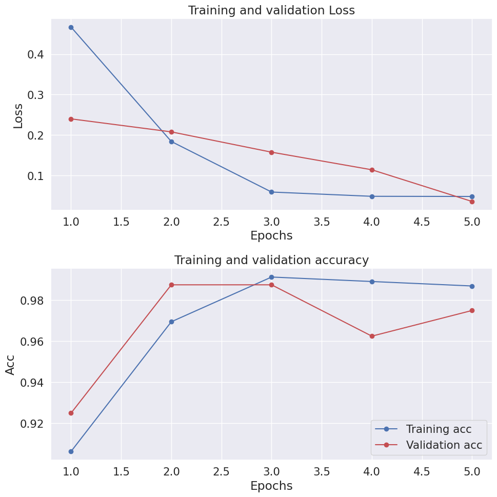
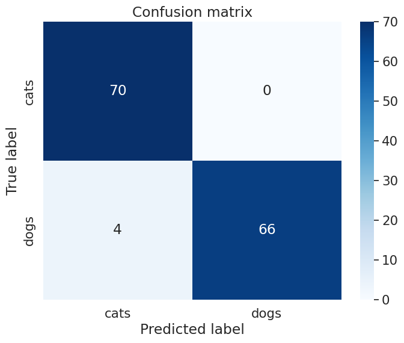
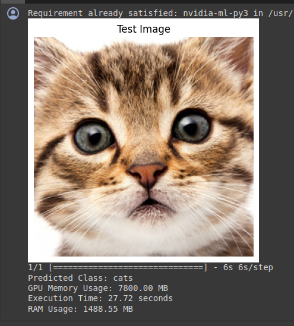
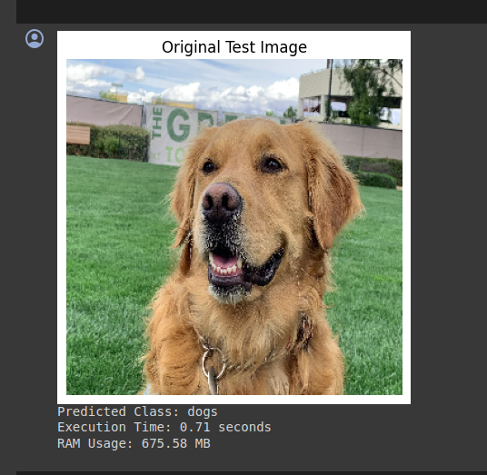

# DL_Lite : Binary Classification on Raspberry-pi

## Overview

DL_Lite is a project aimed at implementing various Machine Learning (ML) and Deep Learning (DL) models on Raspberry Pi using TensorFlow Lite. This project focuses on deploying models efficiently on resource-constrained devices like Raspberry Pi while maintaining high performance.

## Features

- Implementation of ML/DL models on Raspberry Pi using TensorFlow Lite.
- Binary classification of cats and dogs using the implemented model.
- Benchmarks the performance of TensorFlow and TensorFlow Lite models in terms of RAM usage and execution time.

## 1. Inception ResNet V2 Model

### Introduction to Inception ResNet V2 Model

Inception ResNet V2 is a deep convolutional neural network architecture that combines the principles of Inception modules and ResNet blocks. It is known for its exceptional performance on various computer vision tasks, including image classification and object detection.

### Working Principle

The Inception ResNet V2 model consists of multiple Inception blocks, each comprising a combination of convolutional layers with different kernel sizes and depths. Additionally, it incorporates residual connections from ResNet architecture to facilitate training of deeper networks and alleviate the vanishing gradient problem.

### Implementation Details

In the DL_Lite project, we implement the Inception ResNet V2 model with pre-trained weights from ImageNet using TensorFlow and Keras frameworks. The implementation involves:

- Loading the pre-trained weights of the Inception ResNet V2 model trained on the ImageNet dataset.
- Modifying the model architecture for binary classification of cats and dogs by replacing the final fully connected layer with a new output layer.
- Compiling the model with appropriate loss functions, optimizers, and evaluation metrics.
- Fine-tuning the model on a dataset containing labeled images of cats and dogs if necessary.
- Evaluating the model's performance on validation data to assess its accuracy, precision, recall, and other metrics.

### Working Principle

The Inception ResNet V2 model consists of multiple Inception blocks and Residual blocks, which are the building blocks of the network.

### Inception Module

An Inception module is a fundamental component of the Inception ResNet V2 architecture. It consists of multiple parallel convolutional branches with different kernel sizes. The outputs of these branches are concatenated along the channel dimension to form the module's output.

The typical architecture of an Inception module includes:

1. *1x1 Convolution Branch*: This branch applies a 1x1 convolution operation to the input feature maps, allowing for dimensionality reduction and feature transformation.

2. *3x3 Convolution Branch*: This branch performs a 3x3 convolution operation on the input feature maps, capturing spatial information and patterns.

3. *5x5 Convolution Branch*: Similar to the 3x3 branch, this branch applies a 5x5 convolution operation to the input feature maps, capturing larger spatial contexts.

4. *Max Pooling Branch*: This branch employs max pooling to downsample the input feature maps, extracting dominant features from different regions.

The outputs of all branches are concatenated along the channel dimension, forming the final output of the Inception module.
The output of an Inception module can be represented mathematically as:

\[ \text{output} = \text{concatenate}(\text{branch}_1, \text{branch}_2, \text{branch}_3, \text{branch}_4) \]

Where:
- \( \text{branch}_i \) represents the output of the \( i \)-th convolutional branch.
- \( \text{concatenate} \) denotes the operation of concatenating tensors along the channel dimension.

### Residual Block

A Residual block, inspired by ResNet architecture, includes a skip connection that bypasses one or more convolutional layers. The output of the skip connection is added element-wise to the output of the convolutional layers. This helps in mitigating the vanishing gradient problem and facilitates the training of deeper networks.

The typical architecture of a Residual block includes:

1. *Convolutional Layers*: These layers perform feature extraction and transformation on the input feature maps.

2. *Skip Connection*: The skip connection directly passes the input feature maps to the output without any transformation.

The output of the convolutional layers is added to the input feature maps, and the resulting sum forms the output of the Residual block.
The output of a Residual block can be represented mathematically as:

\[ \text{output} = \text{conv\_layers}(\text{input}) + \text{input} \]

Where:
- \( \text{conv\_layers} \) represents the convolutional layers within the block.
- \( \text{input} \) denotes the input tensor to the block.

### Applications

The Inception ResNet V2 model has a wide range of applications across various domains, including:

- Image Classification: Classifying images into predefined categories or labels with high accuracy.
- Object Detection: Detecting and localizing objects within images or videos.
- Medical Imaging: Analyzing medical images for diagnosis and treatment planning.

## Files

The project contains the following files:

1. *Binary_Image_Classifier.ipynb*: This file contains the TensorFlow implementation of the Inception ResNet V2 model with pre-trained weights for image classification. The Colab file for trained model can accessed [here](https://colab.research.google.com/drive/1ajVqBvHMBKsnVrHXw6Lx-3z0ApOU0mc8?usp=sharing#scrollTo=5brc0ettJBeH) and it's benchmark can be accessed [here](https://colab.research.google.com/drive/1__ov9MgOs4XaUcBo7BFnn1N4Rw36cRLD?usp=sharing#scrollTo=ke_3H3m9-DnK).
2. *keras_to_TFLite_Model.ipynb*: This file includes the script to convert the trained Keras model to TensorFlow Lite model.The tensorflow to tensorflow lite conversion can be accessed [here](https://colab.research.google.com/drive/1ijX0LAlUB5m2qAvWhXXqglYpbqftOnff?usp=sharing).
3. *Test_BinaryClassifier_TFLite.ipynb*: This file contains the TensorFlow Lite model generated after conversion.The implementation of the TFLite model and it's benchmark can be accessed [here](https://colab.research.google.com/drive/1P3G9qLZ8PJUeZJeGsG4N92lsId_cKciE?usp=sharing).

## Dependencies

- TensorFlow
- TensorFlow Lite
- Keras
- NumPy

## Results

- Binary Classifier model performance on training. 
    - Accuracy & Loss: 
    - Confusion Matrix : 
  
-  Tensorflow model performance on unconstrained hardware. 
    - Time and RAM usage :  

- Tensorflow Lite model performance on Raspberry pi.
  -   Time and RAM usage : .

--- 
